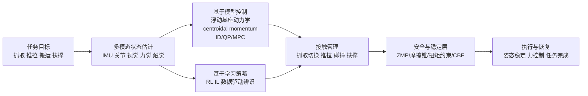

# 人形机器人任务操作稳定性研究报告

## 执行摘要

近十年里，人形机器人“任务操作稳定性”的研究，已经从早期以足底支撑、多接触可行域和逆动力学/QP 为核心的“能站稳、能不倒”，逐步转向“在操作中保持稳定”，也就是把上半身的大幅摆臂、躯干前倾、双臂负载、推拉接触、碰撞恢复、触觉反馈和任务成功率一起纳入统一建模与控制框架。对上半身操作最关键的结论是：**稳定性不是单一的平衡问题，而是浮动基座动力学、质心/角动量管理、接触力可行性、扰动检测与任务级误差共同构成的层级问题**。其中，多接触 ZMP/接触扭矩锥、全身逆动力学/QP、MPC/preview control、以及近两年的触觉皮肤与视觉-力觉融合，是最直接支撑“上半身操作稳定性”的技术主线。citeturn21search19turn18search17turn16search8turn23search11turn40search0turn22view2

如果把方法路线概括为“基于模型”“基于学习”和“混合方法”三类，那么当前最可靠的工程结论是：**基于模型的方法仍然在实时性、安全约束、可解释性方面占优；基于学习的方法在未知扰动、复杂接触与动作多样性方面展现更强潜力；真正接近实用的路线，通常是模型控制做安全底座，学习方法做接触策略、恢复策略或多模态感知增强**。这一判断也与近年的基准结果一致：纯学习在大规模 whole-body benchmark 上依然容易受长时程任务、复杂协调与 sim-to-real 缺口限制，而触觉-视觉-动力学结合的混合系统，在接触丰富、上身受载、多人环境中的优势越来越明显。citeturn26search3turn38search6turn16search3turn40search0turn22view2turn45search8

从应用场景看，工业、服务和救援/远程操作虽共享“上半身稳定”这一核心问题，但关注重点不同：工业更强调负载、重复精度与推拉时的接触力稳定；服务更强调人机接触安全、柔顺性和对突发碰撞的抑制；救援和远程操作更强调大扰动恢复、多接触切换和在未知环境中的保守稳定控制。citeturn31view2turn31view4turn13view1

## 检索范围与分析框架

本报告以 **2016–2026 年** 为主要时间窗口；若文献、平台或数据资源未明确给出某项参数，则统一标注为“未指定”。检索时优先选择来自 entity["organization","IEEE","engineering association"] Xplore、ScienceDirect、arXiv、RSS/ICRA/IROS/RA-L 等原始论文入口，以及平台官方资料页，尤其是 entity["organization","AIST","japan research institute"]、entity["company","本田","automaker"]、entity["company","波士顿动力","robotics company"]、entity["organization","意大利技术研究院","italy research institute"]、entity["company","软银","japan conglomerate"] 与 entity["company","丰田","automaker"] 的公开页面。

本报告采用的分析框架分四层：  
第一层是**动力学可行性**，看浮动基座、多接触、质心与角动量是否能闭环稳定；第二层是**交互可行性**，看抓取、推拉、碰撞和接触切换时接触力是否受控；第三层是**任务可行性**，看上半身姿态、末端位姿/力误差、任务成功率与恢复时间；第四层是**系统可复现性**，看平台参数、扰动协议、统计显著性和开源工具是否支持横向比较。这个四层框架与近年 whole-body control 综述、multi-contact 规划控制、触觉交互和基准工作中反复出现的问题设置基本一致。citeturn21search19turn16search8turn40search0turn28view1

可复用的中英关键词组合示例包括：  
“人形机器人 上半身 稳定性 操作 控制 / 浮动基座 多接触 稳定”；  
“humanoid upper-body manipulation stability”；  
“humanoid multi-contact whole-body control”；  
“humanoid tactile interaction force control”；  
“humanoid push recovery manipulation”；  
“centroidal momentum humanoid manipulation”；  
“humanoid contact switching force perception”；  
“humanoid benchmark whole-body manipulation”。

## 上半身操作稳定性的技术内核

### 动力学建模与上身耦合

对人形机器人而言，上半身操作稳定性不能仅用固定基座机械臂模型解释。双臂伸展、躯干扭转、上举负载、抓取后物体惯量变化，都会通过浮动基座和角动量耦合影响足底接触力分配。因此，近十年的主流研究基本都把问题写成**浮动基座刚体动力学 + 接触约束 + 任务优先级控制**。Caron 等对多接触 ZMP 支撑域的推广，使“上身与墙、扶手、物体”之间的非共面接触首次能被清楚地纳入稳定条件；Moro 与 Sentis 的 whole-body control 综述则把该问题系统化为任务空间逆动力学、优先级和约束管理；Ferrari 等在 2023 年进一步把 multi-contact loco-manipulation 从单点控制延伸到完整规划-控制框架。citeturn18search17turn18search5turn21search19turn16search8

这也是为什么“上半身稳定性”研究很少把双臂、躯干、腿分开做：在大多数真实操作任务里，**上身并不是扰动源之外的附属机构，而是直接参与稳定控制的执行器**。例如，负载举升时躯干前屈会改变质心投影，手部接触会改变系统可行支撑域，靠手扶墙/扶栏又会形成新的稳定多边形或接触扭矩锥。换句话说，上半身操作稳定性本质上是“以操作为中心的全身稳定性”。citeturn18search17turn16search0turn23search0

### 重心、姿态与角动量控制

在控制量上，近十年最常见的稳定变量仍然是 **CoM、ZMP、DCM/CMP、躯干姿态和 centroidal momentum**。但与纯步态控制不同，操作任务里还必须考虑手臂和负载的角动量注入。Caron 等工作的意义在于证明：只看“脚下支撑多边形”对操作任务是不够的，真正相关的是**满足摩擦与接触约束的支撑域**；而 2024 年 Paredes 与 Hereid 的安全 whole-body task-space control，则在 inverse dynamics 的基础上加入控制屏障函数，把 ZMP、摩擦锥、扭矩上界和危险姿态统一到一个 QP 问题中。最近的预览控制工作则进一步说明，多接触动态动作可以在比传统 MPC 更低的在线开销下完成稳定轨迹生成与约束满足。citeturn18search17turn23search11turn23search0turn18search8

这意味着，针对“上半身操作”最有效的姿态控制，并不是单纯“把躯干拉直”，而是要在**躯干姿态误差、臂部操作需求、地面反力分配和未来接触切换风险**之间折中。工业搬运往往允许较小的躯干摆动但要求负载下的力分布可预测；服务场景则更倾向保守躯干姿态与低接触力；救援/远程任务则可能允许更大姿态变化，以换取跨障碍接触或扶撑能力。citeturn31view2turn31view4turn13view1turn23search11

### 力觉、触觉与扰动检测

过去，人形上半身稳定性更多依赖足底 F/T 传感器、腕部 F/T 和 IMU；近两年，一个明显趋势是**从“少量稀疏力传感”转向“全身接触感知”**。iCub 的技术规格展示了较早期但极具代表性的设计：53 DoF、6 个 6 轴力/力矩传感器与超过 3000 个触觉单元，触觉覆盖指尖、手掌、上/前臂、胸部等区域；ASIMO 的多指手掌触觉与手指力传感也说明，精细上身接触控制从很早就被视为“稳定操作”的前提，而不是附属功能。citeturn12view0turn12view1turn33search0turn31view0

到 2025 年，这条路线开始在 whole-body 任务上系统落地。Armleder 等的 *Real-Time Control of a Humanoid Robot for Whole-Body Tactile Interaction* 把整身触觉皮肤、邻近感知和 QP 控制结合，用于柔顺控制、接触力调节和碰撞回避；Murooka 等的 *TACT* 则把关节状态、视觉和触觉同时送入模仿学习策略，并在真实人形平台上完成“保持平衡的全身接触操作”。这类工作共同说明，上身稳定性研究正在从“接触后设法稳住”转向“在触觉感知下提前管理接触”。citeturn40search0turn40search3turn22view2

### 扰动恢复、接触切换与任务级稳定性

扰动恢复和接触切换，是上半身操作稳定性的硬问题。Yang 等的 *Learning Whole-body Motor Skills for Humanoids* 和 Ferigo 等的 *On the Emergence of Whole-body Strategies From Humanoid Robot Push-Recovery Learning* 都表明，面对未知外力、不同受力位置和不同策略切换，单一硬编码控制器很难覆盖全部恢复模式，而学习策略可以自然形成踝策略、髋策略、脚倾覆和跨步策略等多种全身响应。citeturn41view0turn44search15turn44search6

但抓取/推拉/碰撞切换并不是“有恢复就够了”。真正困难的是：**什么时候把某个接触从“扰动”视作“可利用的支撑”，什么时候从“追求位置”切换到“追求力”，以及切换过程中任务成功率如何不显著下降**。Ferrari 等的 multi-contact 框架和 TACT 的 tactile-modality 策略，都把“接触状态管理”放到中心位置；而 EUROBENCH 的基准工作则直接指出，现有研究往往只报告时间或成功率，却缺少反映“稳不稳、是否可重复”的任务级 KPI。citeturn16search8turn22view2turn28view1turn29view1

## 方法谱系与代表性研究对比

从 2016 至今，一个清晰的演化路径是：**多接触稳定判据 → 逆动力学/QP 和 whole-body MPC → 安全约束增强 → 学习式推恢复和全身操作 → 多模态触觉/视觉融合 → 专家到通才的 whole-body generalist 控制**。其中，真正与“上半身操作稳定性”最相关的，不是单纯步行控制，而是那些把手臂、躯干、接触力与任务目标写进同一个控制/学习问题的工作。citeturn18search17turn16search0turn23search11turn41view0turn44search15turn16search3turn22view2turn45search8

上图反映了当前主流系统架构：即使采用学习策略，工业级或真实人形系统也往往保留一个模型化的安全/约束层；而即使采用 QP/MPC，感知层也越来越依赖视觉、触觉和残差估计来做接触管理。citeturn23search0turn40search0turn22view2turn45search8

| 方向 | 代表论文 | 与上半身稳定性的关系 | 主要局限 |
|---|---|---|---|
| 多接触稳定判据 | *ZMP Support Areas for Multi-contact Mobility Under Frictional Constraints* — Stéphane Caron、Quang-Cuong Pham、Yoshihiko Nakamura，2017，DOI: 10.1109/TRO.2016.2623338 | 把上身扶撑、推拉等非共面接触纳入可行稳定域，是分析“手接触能否稳住系统”的基础。 | 依赖接触刚性与摩擦假设，难直接覆盖软接触和复杂碰撞。 citeturn18search17turn18search5 |
| 平台与物理能力 | *Humanoid Robot HRP-5P: An Electrically Actuated Humanoid Robot With High Power and Wide Range Joints* — Kenji Kaneko 等，2019，DOI: 10.1109/LRA.2019.2896465 | 证明高负载、宽关节行程与上身操作能力是稳定搬运的物理前提。 | 更多是平台能力与演示，不是通用稳定控制算法。 citeturn15search0turn31view2 |
| Whole-body MPC | *Whole-Body MPC for a Dynamically Stable Mobile Manipulator* — Maria Vittoria Minniti 等，2019，DOI: 10.1109/LRA.2019.2927955 | 把操作、平衡和交互放入同一预测优化问题，体现“操作稳定性”的核心思想。 | 主要验证对象不是典型双足人形，且仍需精确模型。 citeturn15search15turn15search2 |
| 学习式推恢复 | *Learning Whole-body Motor Skills for Humanoids* — Chuanyu Yang、Kai Yuan、Wolfgang Merkt 等，2019，DOI: 10.1109/HUMANOIDS.2018.8625045 | 学到踝、髋、脚倾覆、跨步等多种全身恢复策略，适合未知扰动与上身受力。 | 主要聚焦恢复，不直接处理复杂接触任务与安全约束。 citeturn41view0 |
| 推恢复的泛化分析 | *On the Emergence of Whole-body Strategies From Humanoid Robot Push-Recovery Learning* — Diego Ferigo 等，2021，DOI: 10.1109/LRA.2021.3076955 | 在 iCub 上分析 whole-body 学习策略如何自然形成稳态恢复与泛化行为。 | 仍以平衡恢复为主，任务级操作指标较少。 citeturn44search15turn44search6 |
| 完整多接触框架 | *Multi-contact Planning and Control for Humanoid Robots: Design and Validation of a Complete Framework* — Paolo Ferrari 等，2023，DOI: 10.1016/j.robot.2023.104448 | 直接面向 humanoid multi-contact loco-manipulation，把接触建立/解除写成完整规划控制链。 | 工程复杂度高，对接触建模和环境先验要求较高。 citeturn16search0turn16search8 |
| 可验证安全控制 | *Safe Whole-Body Task Space Control for Humanoid Robots* — Victor C. Paredes、Ayonga Hereid，2024，DOI: 10.23919/ACC60939.2024.10644227 | 用 CBF 增强 inverse dynamics/QP，把 ZMP、摩擦锥、扭矩和危险姿态纳入安全集。 | 当前更多聚焦行走/避碰，操作接触的任务实现仍在扩展。 citeturn23search11turn23search0 |
| 多模态真实人形控制 | *Learning Multi-Modal Whole-Body Control for Real-World Humanoid Robots* — Pranay Dugar 等，2025，arXiv:2408.07295 | 支持 standing、walking、partial-body mimicry 等多模态指令，展示 learned WBC 向通用接口发展。 | 主要强调通用 whole-body 行为，不专门针对接触丰富操作。 citeturn16search3turn16search15 |
| 触觉交互控制 | *Real-Time Control of a Humanoid Robot for Whole-Body Tactile Interaction* — Simon Armleder 等，2025，DOI: 10.1002/aisy.202500149 | 触觉皮肤 + QP + 力控制，直接服务于全身接触、碰撞回避和柔顺操作。 | 需要大面积触觉硬件与艰难的标定维护。 citeturn40search0turn40search3 |
| 触觉模态模仿学习 | *TACT: Humanoid Whole-body Contact Manipulation through Deep Imitation Learning with Tactile Modality* — Masaki Murooka 等，2025，DOI: 10.1109/LRA.2025.3580329 | 把视觉、触觉、关节状态融合到 whole-body contact manipulation，并在真实人形上保持平衡与行走。 | 训练数据获取成本高，泛化到新任务仍依赖示教覆盖度。 citeturn22view2 |

整体上看，**逆动力学/QP/MPC 已经解决了“把稳定性写进控制器”的问题；学习方法正在解决“让系统在复杂接触和未建模扰动中仍有可用策略”的问题；触觉与安全约束，是二者之间最重要的桥梁**。citeturn23search11turn40search0turn22view2turn45search8

## 平台数据集与开源生态

公开平台给了研究者两个很重要的现实约束：第一，很多人形平台并不公开上半身额定负载；第二，真正适合“上身受载 + 多接触 + 受扰恢复”的公开 benchmark 仍然稀缺。因此，平台物理能力和公开性本身，就是稳定性研究能否复现的边界条件。citeturn31view2turn31view3turn11view0turn28view1turn26search3

image_group{"layout":"carousel","aspect_ratio":"16:9","query":["HRP-5P humanoid robot","Honda ASIMO humanoid robot","Boston Dynamics Atlas humanoid robot","iCub humanoid robot","Pepper robot SoftBank","Toyota T-HR3 humanoid robot"],"num_per_query":1}

| 平台 | 典型定位 | DoF | 主要传感器 | 上半身负载能力 | 公开性 |
|---|---|---:|---|---|---|
| HRP-5P | 工业/重载研究 | 37 | 官方强调 3D 环境测量、对象识别与自主作业感知 | 双臂可处理约 11 kg 石膏板、约 13 kg 胶合板 | 论文与演示公开，控制栈/硬件非开源 citeturn31view2turn15search0 |
| ASIMO | 服务/精细演示 | 57 | 视觉、地面、超声、手掌触觉、手指力传感 | 未指定；更偏精细轻载操作 | 闭源，官方规格公开 citeturn31view0turn33search0turn33search2 |
| Atlas | 工业物料搬运 | 56 | 触觉手指/手掌、360°相机 | 单手 20 kg，持续 30 kg，瞬时 50 kg | 商业闭源，规格公开 citeturn31view3 |
| iCub | 学术研究/儿童尺度 | 53 | 相机、麦克风、IMU、6 个 6 轴 F/T、>3000 触觉单元 | 未指定 | 软件生态最开放，研究复现友好 citeturn12view0turn12view1turn11view0 |
| NAO H25 / NAO6 | 教育/服务/研究 | 25 | 摄像头、麦克风、触觉、声呐、IMU | 未指定 | SDK 开放，硬件闭源 citeturn46search3turn32search4 |
| Pepper | 服务交互 | 20 | 双相机、4 麦克风、触觉、声呐、激光/红外、IMU | 未指定 | SDK 开放，硬件闭源 citeturn31view4turn46search9 |
| T-HR3 | 远程操作/危险环境 | 32 joints + 10 fingers | 全关节 torque servo 模块、远程主从力/运动共享 | 未指定 | 闭源演示平台 citeturn13view1 |

从平台横向比较可以看出，**上半身稳定性最适合在两类平台上研究**：一类是像 iCub 这样传感丰富、软件开放的平台，利于算法验证；另一类是像 HRP-5P、Atlas 这样具有明确上身负载能力的平台，利于真实任务稳定性评估。反过来，NAO、Pepper、ASIMO 更适合研究轻载、交互式或精细接触下的上身姿态与柔顺控制，而不适合重载结论外推。citeturn11view0turn31view2turn31view3turn31view4turn46search3

在数据与仿真资源方面，现状是“**机器人稳定性专用数据集少，human motion / simulation benchmark 多**”：  

| 资源 | 类型 | 对上半身稳定性研究的价值 | 主要限制 |
|---|---|---|---|
| AMASS | 人体全身动作数据库 | 适合模仿学习、上身/下肢协同预训练、动作先验建模 | 不是机器人接触/稳定数据 citeturn24search3 |
| KIT Whole-Body Human Motion Database | 人体全身动作数据库 | 适合 whole-body retargeting 和任务动作库构建 | 缺少机器人受扰与接触标签 citeturn26search12 |
| CMU Motion Capture Database | 人体动作数据库 | 适合动作先验、姿态恢复与 imitation 前训练 | 对操作稳定性缺少专门协议 citeturn26search1 |
| iCubWorld | 机器人视觉数据集 | 适合视觉感知与对象交互研究 | 更偏感知，不是稳定性评测集 citeturn26search2 |
| MuJoCo / Gymnasium Humanoid / HumanoidStandup | 仿真环境 | 快速验证恢复、负载、whole-body reward 设计；支持 MJX/Playground | 仿真接触与现实 compliance 仍有差距 citeturn25search3turn24search0turn37search1 |
| Gazebo Sim | 仿真环境 | 传感器模型、ROS 生态与系统级联调方便 | 接触真实性通常不如专用动力学仿真 citeturn24search2 |
| PyBullet | 仿真环境 | 上手快，支持 URDF/SDF/MJCF 与 RL 原型开发 | 高保真接触与高速动力学有限 citeturn36search11turn36search3 |
| HumanoidBench | 模拟 benchmark | 27 个 whole-body 控制任务，有操作和 locomotion 子集 | 仍是 simulated benchmark，不等价于真实人形稳定实验 citeturn38search6turn37search0 |

可见，**直接面向“上半身受扰、接触切换、恢复过程”的公开数据集仍近乎空缺**；现实研究大都依赖“人体动作库 + 仿真 benchmark + 少量真实机器人试验”这一组合来填补证据链。citeturn24search3turn26search12turn38search6turn28view1

对复现最重要的开源实现与工具，建议优先关注以下项目，名称后的引用可直接作为官方入口：

- `whole-body-controllers`：面向 iCub 的 Simulink 全身平衡与力矩控制基线。citeturn35search0turn35search4  
- `TSID`：任务空间逆动力学库，适合 QP/优先级控制。citeturn35search1  
- `Pinocchio`：高效刚体动力学与解析导数库，是很多 whole-body 控制与优化器的基础。citeturn35search6turn35search5  
- `Crocoddyl`：多接触最优控制与 DDP 工具链。citeturn35search3turn35search7  
- `YARP`：人形机器人常用中间件，尤其在 iCub/robotology 生态中重要。citeturn36search1turn38search22  
- `MuJoCo Playground`、`Gazebo Sim`、`PyBullet`：分别代表 GPU 加速 sim-to-real、系统级仿真和快速原型开发。citeturn37search1turn24search2turn36search11  
- `HumanoidBench`、`EUROBENCH`：前者是 simulated whole-body benchmark，后者提供协议与 benchmarking software。citeturn38search6turn38search0turn38search4  

## 评估方法与局限

### 性能指标与实验设计

现有文献对“稳定性”的度量，已经明显从单一成功率转向多层 KPI。EUROBENCH 针对 whole-body manipulation 的工作非常有代表性：它把时间、放置精度成功率、操作成本、电流消耗和机械功同时纳入；而 Monteleone 等的平衡韧性 benchmark 则把外部扰动协议本身标准化，包含 impulsive、quasi-static、sinusoidal 与 repetitive CoM perturbation 等多种施扰形式，并给出可重复的 testbed 与性能指标。NIST 的 benchmark 方法学进一步强调，统一对象、统一协议和统计分析，才使跨系统比较有意义。citeturn28view1turn29view1turn30search1turn30search7turn28view2

| 评估维度 | 推荐指标 | 文献中的典型量级或协议示例 | 说明 |
|---|---|---|---|
| 任务完成性能 | 任务成功率、完成时间 | REEM-C 箱体 whole-body manipulation：52.96–62.41 s | 时间不能单独代表稳定性 citeturn29view1 |
| 上半身任务精度 | 末端位姿误差、放置位置/姿态误差 | 同一 benchmark 采用 2.5% 与 5% 放置精度成功率阈值 | 建议将上身位姿误差与任务误差分开报告 citeturn29view1 |
| 稳定/能耗 | 机械功、电流成本、CoM/ZMP/躯干姿态误差 | 同一 benchmark 的机械功 561.69–2585.25 J，成本 10802–20246 A·s/kg | 能源代价常能揭示“看似稳但代价过高”的控制器 citeturn29view1 |
| 扰动恢复 | 最大可承受冲击、恢复时间、是否跨步/扶撑成功 | 平衡韧性 benchmark 使用 impulsive、sinusoidal、quasi-static 等五类协议，总实验 >1100 次 | 恢复时间必须配合扰动类型和幅值报告 citeturn30search1turn30search4 |
| 接触控制 | 接触力/扭矩误差、接触切换 overshoot、滑移率 | Tactile interaction 与 TACT 类工作更强调接触调节与碰撞回避 | 当前缺少跨平台统一阈值 citeturn40search0turn22view2 |
| 基准可复现性 | 每 run 重复次数、对象重量变化、场景覆盖度 | EUROBENCH 推荐每个 protocol 单次 run 做 10 次放置并逐步增重 | 很多论文仍只给 3–5 次 demo，统计功效不足 citeturn28view1 |

对真实机器人实验，建议采用以下统计做法：**报告均值 ± 标准差并给出 95% 置信区间；对同一场景下的两种控制器使用 paired 设计；对非高斯、小样本结果优先使用 Wilcoxon/置换检验或 paired bootstrap；对成功率给出 Wilson 或 Clopper–Pearson 区间**。这不是所有人形论文当前都做到的实践，但和 NIST benchmark 方法学、recent paired bootstrap protocol 的方向一致，更适合高方差、低样本的机器人实验。citeturn28view2turn27search0

### 基于模型、基于学习与混合方法的优缺点

下表是基于前述综述、基准和代表性论文做出的归纳性判断，而非单篇论文的原文结论。归纳依据主要来自 whole-body control 综述、HumanoidBench、Yang/Ferigo 的学习恢复工作、Paredes 的安全控制以及触觉交互与 TACT 等研究。citeturn21search19turn26search3turn41view0turn44search15turn23search11turn40search0turn22view2

| 维度 | 基于模型控制 | 基于学习 | 混合方法 |
|---|---|---|---|
| 泛化 | 对已知动力学、已知接触和已知任务约束泛化强；对软接触、模型误差和新物体敏感 | 对随机扰动、复杂动作模式和局部未建模现象更有适应力；对 OOD 场景不稳定 | 通过模型层做安全包络、学习层做策略补偿，当前最均衡 |
| 样本效率 | 高，主要依赖模型与少量调参 | 低，训练数据/仿真算力成本高 | 中等，示教 + 模型 + 少量 real data 往往最有效 |
| 实时性 | 在线求解 QP/preview/MPC 已较成熟 | 推理很快，但训练极重；真实系统中的安全调试周期长 | 取决于系统集成，但通常可达到实用控制频率 |
| 安全性 | 最强，可显式施加 ZMP、摩擦锥、扭矩与姿态边界 | 最弱，若无安全层则难保证硬约束 | 强，尤其适合 CBF/WBC + policy 的设计 |
| 可解释性 | 强，可追踪为何失稳、为何切换接触 | 弱，失稳原因常隐藏在策略表示中 | 中等，可把“安全原因”和“策略原因”部分分离 |
| 典型问题 | 模型不准、柔性/碰撞接触难写、调参复杂 | sim-to-real 落差、失败代价高、复现难 | 工程复杂度最高，对系统集成要求高 |

一个经常被忽略的细节是：**鲁棒控制、滑模控制和扰动观测器并没有消失，但在近十年的人形 whole-body 核心文献里，它们往往不再作为主框架，而更多退到关节层、执行器层或 compliance layer 做补偿**；在系统层面的“主角”已经变成 inverse dynamics/QP/MPC、CBF 和多模态感知。citeturn21search19turn19search8turn19search6

### 开放问题与证据缺口

当前研究仍存在四个明显缺口。第一，很多论文研究的是“平衡”或“操作”之一，而不是“操作中的稳定性”，导致指标失配。第二，公开 benchmark 虽已开始定义 protocol，但“上半身受扰、抓取-推拉切换、碰撞后恢复”仍缺少行业通用 testbed。第三，平台公开参数不完整，尤其是上半身额定负载、传感器带宽、扭矩饱和和失败日志常常缺失。第四，真实机器人实验样本量普遍偏低，统计显著性分析远落后于机器人学习方法本身的复杂度。citeturn28view1turn30search1turn31view2turn31view3turn11view0

## 未来研究方向与建议

下面给出的方向，是基于当前文献证据和缺口做出的**可执行研究/工程建议**：

- **多模态接触状态估计**：把视觉、腕部 F/T、关节残差、IMU 和触觉皮肤统一为接触状态机，而不是把它们分散在不同模块里。对上半身操作来说，这比单纯提高控制带宽更关键。citeturn40search0turn22view2  
- **可验证的安全控制底座**：无论上层用 RL、IL 还是 generalist policy，下层都应保留 CBF/WBC 或显式接触约束层，至少对 ZMP、摩擦锥、扭矩、姿态和自碰撞做硬约束。citeturn23search11turn23search5  
- **样本高效的仿真到现实迁移**：建议从“只做 domain randomization”转向“参数辨识 + 残差策略 + 少量真实微调”的三段式流程，尤其针对躯干-手臂耦合、负载变化和接触 compliance。citeturn16search3turn45search8turn26search3  
- **上半身与下肢协同控制的一体化设计**：不要把“上肢做操作、下肢做平衡”当作默认架构。高质量系统应在同一代价函数或同一策略接口里管理躯干、臂部、足底与环境接触。citeturn16search0turn18search17turn15search15  
- **在线自适应辨识与负载感知**：负载变化、抓持姿态变化和工具更换是上半身失稳的重要来源。建议部署在线惯量/摩擦/外力辨识，而不是假定物体模型恒定。citeturn20search2turn31view2  
- **任务级鲁棒性指标标准化**：建议把“成功率 + 放置误差 + 接触力误差 + 恢复时间 + 机械功/电流成本 + 失败模式分类”作为最小 KPI 集合，并配套统一扰动协议。citeturn28view1turn30search1turn28view2  
- **全身触觉硬件与软件协同设计**：仅有触觉皮肤还不够，必须同时考虑校准、漂移、接触定位、带宽和 QP/策略接口，否则触觉很难真正改善稳定性。citeturn40search0turn22view2  
- **从专家策略到通才控制器**：generalist whole-body control 与行为基础模型很可能是未来方向，但其落地前提不是“更大模型”，而是可验证的安全边界、可解释的接触表示和跨任务统一 KPI。citeturn45search8turn45search3turn23search11  

归纳来看，未来最值得投入的路线不是“纯模型”或“纯学习”的二选一，而是：**安全可验证的模型底座 + 多模态接触感知 + 任务级 benchmark + 面向 payload/扰动/接触切换的学习增强**。如果从工程实现优先级排序，我会建议先做“统一指标和协议”，再做“状态估计和安全层”，最后才是“通才策略”。因为没有可比的 task-level robustness 指标，任何“更稳”都很难真正被证实。citeturn28view1turn30search1turn26search3turn23search11